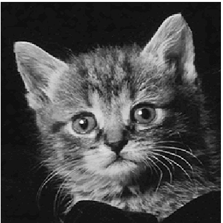
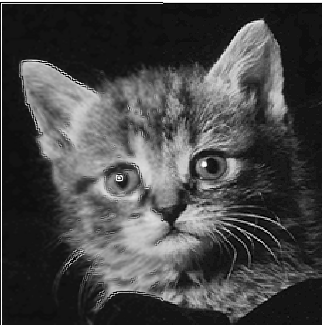
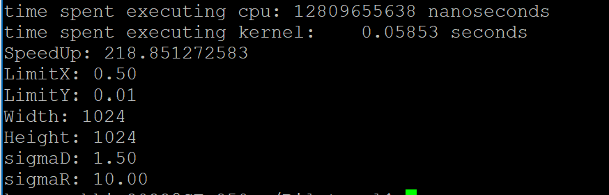
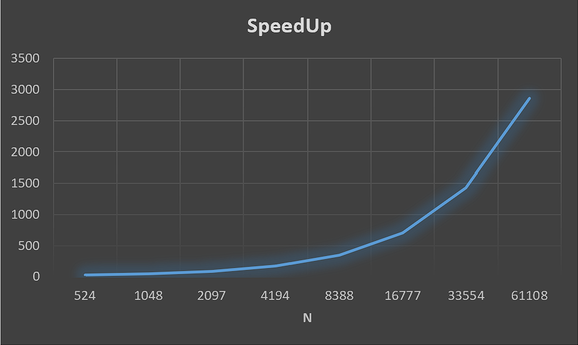

# BalateralFilter
*Данная лабораторная работа заключается в реализации билатерального фильтра для обработки изображения*
* Лабораторная представлена 2 файлами: .cu и make
* Также для работы требуются файлы библиотеки EasyBMP для работы с файлами BMP
* В файле .cu содержится код хоста, функция для последовательной обработки и функция ядра
* make файл используется для компоновки .cu и файлов библиотеки
* После компоновки, используя команду *make* код запускается с помощью команды *./BilFiltr 1й_арг 2й_арг 3й_арг 4й_арг
* 1й_арг, 2й_арг это проценты обработки по 1й и 2й координате соответсвенно (0,1]
* 3й_арг, 4й_арг это контстанты sigmaD и sigmaR, соответсвенно. Они используются в формулах билатерального фильтра

##### .cu устроен так: 
1. Вначале идут реализации функций (функция вывода ошибки для CUDA, функция расчёта G(в 9 точечном шаблоне значения одни и теже), функция билатерального фильтра и последовательного прохода окна для последовательной обработки и функция ядра)
2. После инициализации и проверки ввода процентов обработки и сигм создаётся и инициализируется объект хранящий данные обрабатываемого изображения
3. Создаётся вектор векторов ***a***, который обрабатывается так чтобы изображение было в его центре, а по краям были копированные данные из границ изображение
4. Создаётся одномерный массив ***h_data***, который хранит только данные изображения
5. Создаются одномерные массивы ***G_h*** и ***G_d***, которые хранят данные G
6. Выделяется память под ***G_h*** на хосте и вызывается функция, которая заполняет его значениями
7. Выделяется память под ***G_d*** на девайсе и вызывается функция, которая копирует данные на GPU
8. Создаётся cudaChannelFormatDesc, который хранит информацию об канале для cudaArray_t
9. С помощью cudaMallocArray и cudaMalloc выделяется память под соответсвующие массивы.
10. Создаётся cudaArray_t для дальнейшего его преобразрвания в текстуру и массив arrayOutput для записи на видеокарте полученных данных
11. Создаются объекты хранящие настройки текстуры: resDesc - хранит где размещены данные текстуры и тип массива, texDesc хранит информацию о доступу к элементам текстуры
12. Создаётся объект текстуры, создаются ивенты для дальнейшего замера времени
13. Создаются ивенты для вычисления времени
14. Засекается время старта, вызывается функция ядра, синхронизируются CPU и GPU, засекается время конца
15. Массив arrayOutput копируется с GPU на CPU в h_data
16. Производится замер времени, вызов функции для последовательной обработки, замер времени
17. Выводятся время работы каждой функции, ускорение и данные запуска
18. Обработанные изображения записываются в файлы
19. Очищается память  
##### функция ядра устроена так:
1. Используется виртуальная архитектура CUDA для вычисления 1го и 2го индекса каждой нити 
2. Каждая нить объявляет нужные для вычисления переменные в регистровой памяти
3. Чтобы не записывались "неправильные" данные ограничиваются индексы у нитей
4. Каждая нить последовательно вычисляет данные из текстуры с помощью tex2D<float>()
5. Вычисленные переменные определяют новое значение пикселя
6. Так как в текстуре хранится транспонированное изображение, то и записываем в выходной массив значения пикселя по транспонированным координатам
  
* Входное изображение

* Выходное изображение CPU c процентами обработки 0.5, 1 и сигмами 1 и 50
.bmp)
* Выходное изображение GPU c процентами обработки 0.5, 1 и сигмами 1 и 50
.bmp)
* Выходное изображение GPU c процентами обработки 1, 1 и сигмами 0.5 и 10
 .bmp)
* Выходное изображение GPU c процентами обработки 1, 1 и сигмами 1.5 и 75
 .bmp)

* Входное изображение *

* Выходное изображение GPU c процентами обработки 0.5, 1 *

  
* Вид выходных данных

* График зависимости ускорения от количества обрабатываемых пикселей

* Видно что ускорение возрастает квадратично
##### Баг или фича
* Почему-то функция ядра нормально работает только с квадратными картинками
* В случаем прямоугольных она делает наслоени исходной картинки, даже если нитей выделяется меньше размера картинки.
